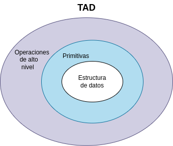

# Ejercicio de modelado de Alumnos

[](https://github.com/uqbar-project/eg-alumnos-c/actions/workflows/build.yml)

Resolución del ejercicio de alumno en ANSI C modelando con TADs y testeado con cSpec perteneciente [al apunte](https://docs.google.com/document/d/11C2UAbP70dP7sTID-ZxJm_a-5ypKxQUEuZr6GVk5yFI/edit?usp=sharing) de modelado del paradigma funcional.

## Cómo instalar 
1. Eclipse C/C++ / VS Code
2. [cSpec](https://docs.utnso.com.ar/guias/herramientas/cspec)
   
     para su instalación correr 
	```bash
    git clone https://github.com/mumuki/cspec.git
    cd cspec
    make
    sudo make install
	```
	
## Enunciado

Modelar un alumno, que define

- un nombre, 
- la fecha de nacimiento, 
- el legajo (sin dígito verificador), 
- las materias que cursa 
- y el criterio para estudiar ante un parcial:
  - algunos son estudiosos: estudian siempre, 
  - otros son hijos del rigor: estudian si el parcial tiene más de n preguntas, 
  - y también están los cabuleros, que estudian si la materia tiene una cantidad impar de letras. 

## Requerimientos

1. Modelar un parcial
1. Modelar el tipo que representa el criterio de estudio.
1. Modelar genéricamente un alumno.
1. Representar con la abstracción que crea más conveniente al criterio estudioso, hijo del rigor y cabulero.
1. Modelar a Nico, un alumno estudioso
1. Hacer que Nico pase de ser estudioso a hijo del rigor (buscar una abstracción lo suficientemente genérica)
1. Determinar si Nico va a estudiar para el parcial de Paradigmas

## Modelado

Si bien se implementa un recorte del enunciado, creamos un **TAD** que representa la abstracción de Alumno. En nuestro diseño tomamos **la estructura de datos** y construimos sobre él

- las funciones primitivas, que están acopladas a esa estructura desde la interfaz
- y funciones de más alto nivel, que en su interfaz solo reciben el alumno y dejan los detalles internos a la implementación.

En general, podemos modelar un TAD en capas, como se muestra a continuación:



Y más específicamente para un alumno:


## Implementación

Veamos cómo el modelo en cuestión define la siguiente estructura de datos y funciones que trabajan sobre los mismos:

```C
// ***************************************************************************
// TAD Alumno - Interfaz
// ***************************************************************************

// ***************************************************************************
// estructura del Alumno
typedef struct AlumnoType {
  string nombre;
  string apellido;
  string direccion;
  int edad;
  int legajo;
  bool (*criterioEstudio)(Parcial*);
} Alumno;

// ***************************************************************************
// función constructora
Alumno * Alumno_new(string nombre, string apellido, string direccion, int edad,
    int legajo, bool (*criterioEstudio)(Parcial *));

// ***************************************************************************
// primitivas
void setCriterioDeEstudio(Alumno * unAlumno, bool (*criterioEstudio)(Parcial*));

// ***************************************************************************
// operaciones de alto nivel
string nombreCompleto(Alumno * unAlumno);
bool esMayorDeEdad(Alumno * unAlumno);
bool estudia(Alumno * unAlumno, Parcial * unParcial);
```

El criterio de estudio lo consideramos como una nueva abstracción que se modela en otro **TAD**, ya que si bien no tiene un estado (que modelamos con la estructura), tenemos comportamiento diferencial bien definido. 

```c
bool estudioso (Parcial *);
bool hijoDelRigor (Parcial *);
bool hijoDelRigorConMasDe (int, Parcial *);
bool cabulero (Parcial *);
```

Para verificar el funcionamiento de nuestro modelo se realizaron una serie de tests que pueden ejecutar.

## Diagrama general de la solución

Los archivos terminan conformando un módulo o componente que resuelve los requerimientos pedidos para alumno:


En nuestro diseño podemos pensar

- que a bajo nivel, alumno, criterio de estudio y parcial son componentes de nuestro módulo Alumno
- a más alto nivel, el módulo Alumno conforma un componente en sí mismo para trabajar con otros módulos para terminar de conformar un sistema

## Creación y destrucción de alumnos

- en la implementación de *Alumno_new* se encuentra comentado el _malloc_ que solicita el espacio de memoria, dado que fue reemplazado por la línea siguiente que ejecuta un [macro de Ansi C](https://gcc.gnu.org/onlinedocs/cpp/Macros.html)
- lo mismo para el free
- y otro detalle es que definimos un alias de tipo para `char *` a `string`. Eso permite subir el nivel de nuestra definición, y podríamos hacer lo mismo para los punteros a TAD (lo dejamos para otra iteración)

## Cómo correr los tests

En la carpeta raíz hacer

```bash
make    # o sudo make si no tenés permisos
./eg-alumnos-c
```